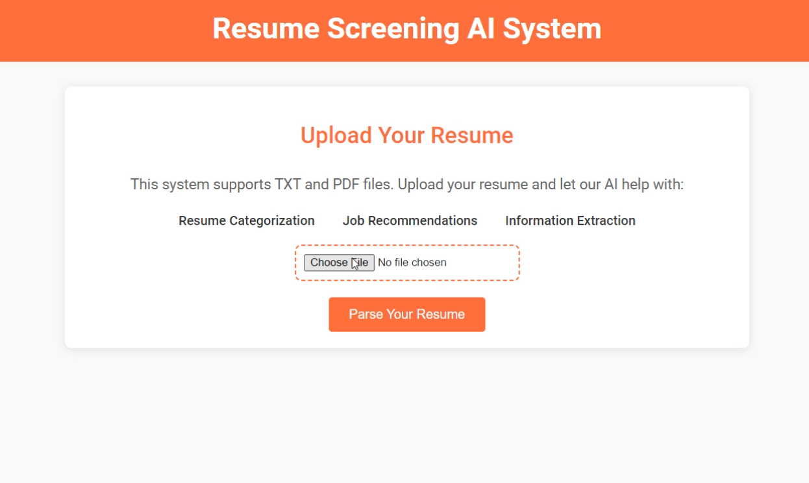

# Resume Parser and Job Recommendation System

## Description

This project is a **Resume Parser and Job Recommendation System** that categorizes resumes and provides job recommendations based on parsed information. The system leverages machine learning techniques to analyze resume content and match it with suitable job roles, streamlining the recruitment process.

## Table of Contents
- [Description](#description)
- [Table of Contents](#table-of-contents)
- [Installation](#installation)
- [Usage](#usage)
- [Features](#features)
- [Project Architecture](#project-architecture)
- [Contributing Guidelines](#contributing-guidelines)
- [License](#license)
- [Authors and Acknowledgements](#authors-and-acknowledgements)
- [Changelog](#changelog)
- [References and Further Reading](#references-and-further-reading)
- [Contact Information](#contact-information)

## Installation

Follow these steps to set up the project locally:

1. **Clone the repository**:
   ```bash
   git clone https://github.com/levi1775/ResumeParser.git
   cd ResumeParser
2. **Create and activate a virtual environment (optional but recommended)**:    
   ```bash
   python3 -m venv venv
   source venv/bin/activate  # On Windows use `venv\Scripts\activate`
3. **Install the required dependencies**:    
   ```bash
   pip install -r requirements.txt
   
4. **Run the Jupyter Notebook**:    
   ```bash
   jupyter notebook

## Usage

### Resume Categorization:
- Open the `Resume Catogorization prediction.ipynb` notebook.
- Run through the cells to train the model and categorize resumes.
- The model will output the predicted job categories based on the resume content.

### Job Recommendation:
- Open the `Resume Job Recommendation System.ipynb` notebook.
- Run the cells to analyze resumes and provide job recommendations.
- The system will suggest jobs that match the skill set and experience outlined in the resume.

## Features

- **Resume Categorization**: Automatically categorize resumes into predefined job roles using machine learning algorithms.
- **Job Recommendations**: Provide job role suggestions based on the parsed resume data.
- **Customizable**: The model can be fine-tuned with additional data to improve accuracy.
- **Extensible**: Easily integrate with existing HR systems or job portals.

## Project Architecture

The project consists of two main components:

### Resume Categorization:
- Processes resumes using NLP techniques.
- Utilizes a machine learning model to categorize resumes into different job roles.

### Job Recommendation System:
- Analyzes resume content to recommend suitable job roles.
- Uses a content-based filtering approach to match resumes with job descriptions.

## Contributing Guidelines

Contributions are welcome! Please follow these steps:

1. Fork the repository.
2. Create a new branch (`git checkout -b feature-branch`).
3. Commit your changes (`git commit -m 'Add some feature'`).
4. Push to the branch (`git push origin feature-branch`).
5. Open a pull request.

## License

This project is licensed under the MIT License - see the [LICENSE](LICENSE) file for details.

## Authors and Acknowledgements

- **Vedant Pimple** - *Initial work* - [YourGitHubProfile](https://github.com/YourGitHubProfile)

## Changelog

- **v1.0.0**: Initial release with resume categorization and job recommendation features.

## Preview

Here is a demo of the resume parser in action:




  

## References and Further Reading

- [Spacy](https://spacy.io/)
- [Scikit-learn](https://scikit-learn.org/stable/)
- [NLTK](https://www.nltk.org/)

## Contact Information

For any inquiries, please contact Vedant Pimple at [vedantpimple1775@gmail.com](mailto:vedantpimple1775@gmail.com).
